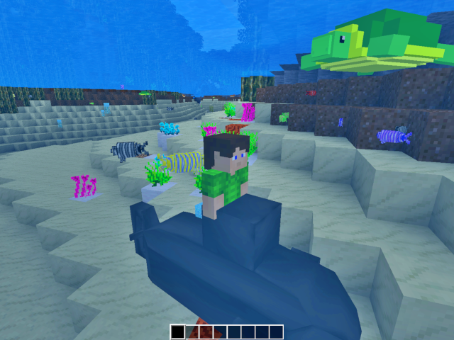

Submmarines Version 1.00
========================

Overview
--------

Submmarines is a mod that adds submarine to the Minetest game.  
You can board them and sail the ocean.  

This is a fork by michyo from submarines (by sirrobzeroone).  
(Submmarines GitHub repository: [https://github.com/michyo/submmarines](https://github.com/michyo/submmarines))  
(GitHub of original submarines: [https://github.com/sirrobzeroone/submarine_pack](https://github.com/sirrobzeroone/submarine_pack))  

It has been modified to be peaceful. :)  
No more torpedoes, no more destroyers.  
Let's head to the ocean survey!  

And adjusted to work correctly in Minetest version 5.2.0.  

Screenshot
----------

Installation
------------

1. Download zip. ([https://github.com/michyo/submmarines/archive/master.zip](https://github.com/michyo/submmarines/archive/master.zip))  
2. Unpack it in one folder and put it in your Minetest mods folder.  
3. Enable it in the Minetest.  

Depends
-------

* default

Controls
--------

    Look around      : Move mouse  
    Move forwards    : W  
    Move to the left : A  
    Move backwards   : S  
    Move to the right: D  
    Diving           : Shift  
    Surfacing        : Space  
    Put & collect    : Left mouse button  
    Getting on & off : Right mouse button  

Recipe
------

#### Submarine (submmarines:submarine)

    "default:steelblock", "default:steelblock", "default:steelblock"  
    "default:steelblock", "default:mese"      , "default:steelblock"  
    "default:steelblock", "default:steelblock", "default:steelblock"  

Version History
---------------

#### 1.00 (2020/04/08):

* Initial release

License
-------

Copyright (C) 2020 michyo (Michiyo Tagami) [[https://michyo.net/](https://michyo.net/)]  

#### Code: MIT License

    Original Submarines: sirrobzeroone, krokoschlange, PilzAdam  
    Submmarines: michyo (Michiyo Tagami)  

#### Media: CC BY-SA 3.0

    Textures and model: krokoschlange  

See the LICENSE.txt for more details.  
